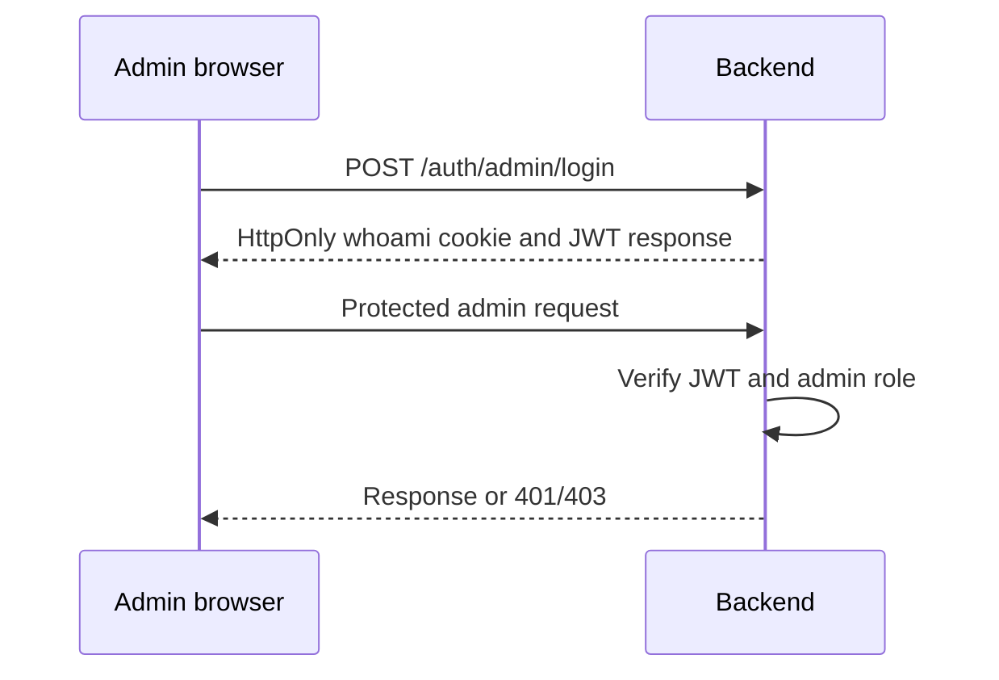

# Authentication and authorisation

## Purpose

Record the current authentication behaviour and the work required before production use.

## Current admin flow

`POST /auth/admin/login` checks one environment-configured admin email/password hash. On success it signs a JWT and sets the `whoami` cookie. Protected `/admin/*` API routes use `authenticateAdmin` to verify that token and require `role: admin`.

The Next.js proxy redirects admin navigation based on cookie presence. It does not verify the token itself.

## Current visitor flow

Visitors provide contact details to `/api/users`; the frontend stores returned user and conversation IDs in browser cookies. These IDs currently act as client identifiers rather than an authenticated visitor session.

## Security status

Current visitor HTTP and socket actions are not ownership-authorised. Socket events trust role and identity fields supplied by the client. The login response is also stored in browser `localStorage` by the frontend.

## TODO

Replace raw-ID visitor access with scoped server-verifiable sessions. Authenticate Socket.IO at handshake, derive identity/role/tenant on the server, remove browser-accessible admin token storage, and define multi-user/workspace role policies.

See [security overview](../security/overview.md) and [checklist](../security/checklist.md).

