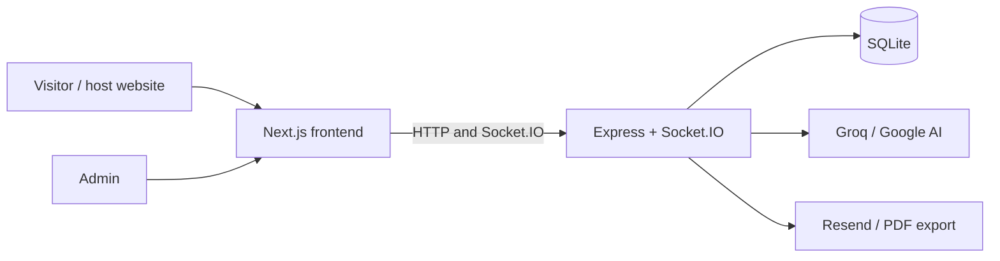

# Architecture overview

## Purpose

Describe the current high-level structure of the chat application.

## Current system

The repository is an npm-workspaces project with two applications:

- `frontend`: Next.js App Router UI for visitor chat, embeddable widget, and admin inbox.
- `backend`: Express and Socket.IO service for HTTP APIs, realtime events, SQLite storage, AI replies, and email exports.

SQLite is the current persistence layer. The frontend connects directly to the backend API and Socket.IO endpoint using public environment URLs.

## Boundaries

- The Next.js application renders `/`, `/chat`, `/widget`, and admin routes.
- The Express process owns `/api/*`, `/admin/*`, `/auth/admin/*`, and Socket.IO.
- The embed loader in `frontend/public/embed.js` creates an iframe pointing at `/widget`.

## Current limitations

- This is a single-business design; no workspace/tenant model exists.
- Realtime presence, transfer state, AI locks, and quotas are process-memory Maps.
- SQLite schema creation happens from application startup rather than versioned migrations.

See [database](database.md), [WebSocket](websocket.md), and [security overview](../security/overview.md).

