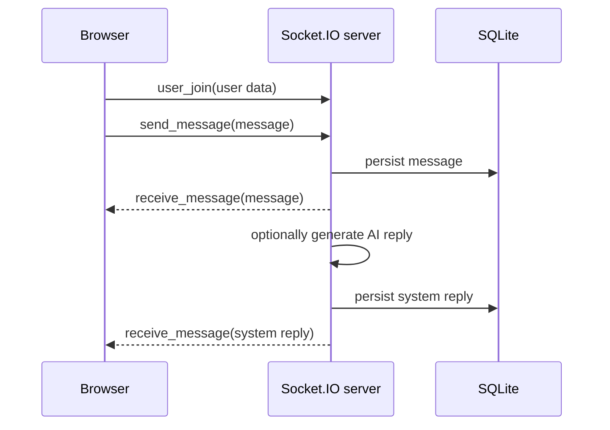

# WebSocket architecture

## Purpose

Describe the current Socket.IO event model and its operational limitations.

## Current flow

The frontend connects to `NEXT_PUBLIC_API_URL` using Socket.IO at `/socket.io/`. On connection, the client emits `user_join`. The backend creates rooms named `user-{id}` and `conversation-{conversationId}` and emits messages to conversation rooms.

## Events in use

- Client to server: `user_join`, `send_message`, `typing_start`, `typing_stop`, `close_conversation`, `transfer_request`.
- Server to client: `receive_message`, `user_typing`, `user_stopped_typing`, `user_online`, `user_offline`, `users_online`, `conversation_closed`, and `system_offline_for_conversation`.

## Current limitations

- No Socket.IO handshake authentication or server-side event authorisation is implemented.
- Presence, room assignment, transfer state, and AI response locks are held in process memory.
- `request_sync` is emitted by the frontend but no server handler currently exists.
- There is no event acknowledgement, durable delivery state, cursor sync, or typing expiry.

## TODO

Define versioned event schemas, authenticated room membership, acknowledgement/error contracts, reconnect resynchronisation, and a distributed Socket.IO adapter before horizontal scaling.

See [authentication](authentication.md) and [security checklist](../security/checklist.md).

