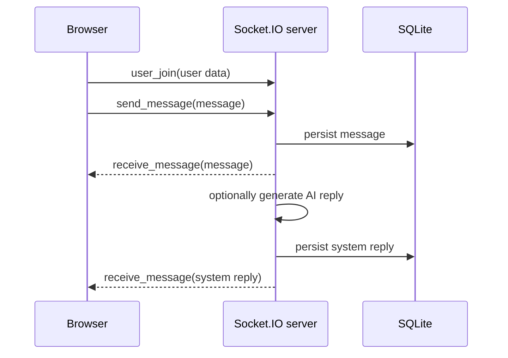

# WebSocket architecture

## Purpose

Describe the current Socket.IO event model and its operational limitations.

## Current flow

The frontend connects to `NEXT_PUBLIC_API_URL` using Socket.IO at `/socket.io/`. The authenticated client emits `user_join`; the backend derives identity and tenant from the session, creates tenant/user/conversation rooms, and emits messages to conversation rooms. Socket.IO transport heartbeat is used with reconnect and explicit conversation resynchronisation.

## Events in use

- Client to server: `user_join`, `sync_conversation`, `send_message`, `mark_read`, `typing_start`, `typing_stop`, `close_conversation`, and `transfer_request`.
- Server to client: `receive_message`, `conversation_read`, `user_typing`, `user_stopped_typing`, `user_online`, `user_offline`, `users_online`, `conversation_closed`, and `system_offline_for_conversation`.

## Current limitations

- Presence, room assignment, transfer state, typing timers, and AI response locks are held in process memory; they do not yet work across multiple backend processes.
- Messages use acknowledgement callbacks, duplicate message IDs are idempotent, and reconnect performs a cursor-compatible `sync_conversation` request.
- Typing is automatically expired after five seconds. Presence tracks a set of sockets per authenticated principal, so one browser tab disconnecting does not mark another tab offline.

## TODO

Define versioned event schemas, a distributed Socket.IO adapter, durable presence/typing state, and cross-process delivery guarantees before horizontal scaling.

See [authentication](authentication.md) and [security checklist](../security/checklist.md).
